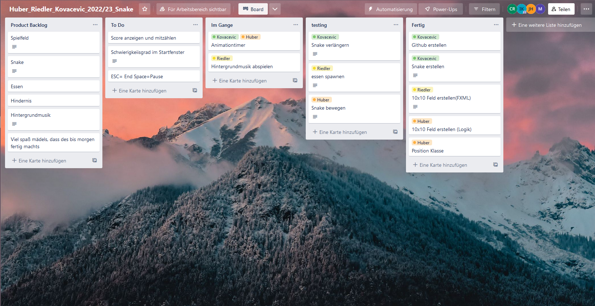

Zur Organisation mit Scrum wurde Trello verwendet. 
Am Anfang fügten wir dem Product Backlog die einzelene Ziele grob zu, um dann aus diesen Zielen einzelene ToDo Aufgaben zu fertigen.  
Zu den einzelene Aufgaben wurde eine genaue Beschreibung hinzugefügt.

